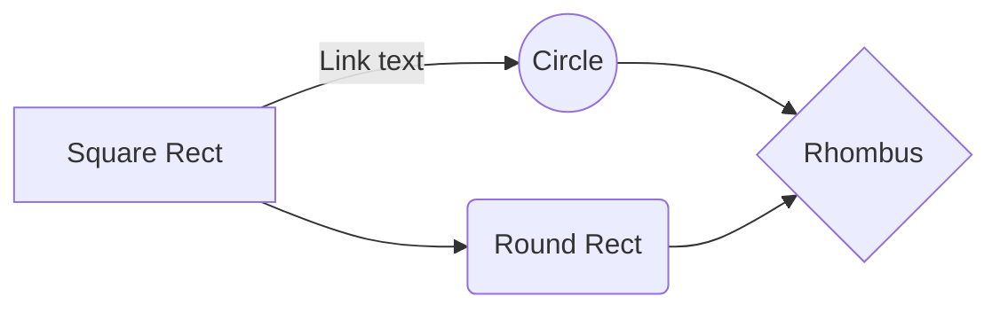

# Make-git-flow

This Python is aimed to make git flow website effortless. The chosen Git Flow is the four stage based on Vincent Driessen "A successful Git branching model"   [post](https://nvie.com/posts/a-successful-git-branching-model/).
The set up will follow [Git flow](https://danielkummer.github.io/git-flow-cheatsheet/index.fr_FR.html). Therefore you might need to install with : 
```
sudo apt-get install git-flow 
```

# How it works

It's a command line tool that ask you for several information intended to automate a website git-flow oriented model.


## The Basic (dev, main)

Two stages is the basic model. Pretty sufficient to test a concept or to make proof of concept. The main is usually on a live website. 
git push [branch] dev
git push [branch] master

## The Stage (dev, staging, main)

Three stages may be useful to show a pre-production version of the website

## The pro (dev, hotfix, staging, main)

You can rename the current file by clicking the file name in the navigation bar or by clicking the **Rename** button in the file explorer.


# Installing
## git flow init :
$ git flow init
```BASH
Which branch should be used for bringing forth production releases?
   - master
Branch name for production releases: [master] main #because we live in the 21st century
Branch name for "next release" development: [develop] 

How to name your supporting branch prefixes?
Feature branches? [feature/] 
Bugfix branches? [bugfix/]
Release branches? [release/] 
Hotfix branches? [hotfix/]
Support branches? [support/] 
Version tag prefix? [] 
```

### Installing Python
We will folllow the [hypermodern Python guide](https://cjolowicz.github.io/posts/hypermodern-python-01-setup/)
It starts by installing the right stuff :

```BASH
sudo apt update && sudo apt install -y make build-essential libssl-dev zlib1g-dev \
libbz2-dev libreadline-dev libsqlite3-dev wget curl llvm libncurses5-dev \
libncursesw5-dev xz-utils tk-dev libffi-dev liblzma-dev python-openssl git
```

We'll need to install the environnement :
```BASH
curl https://pyenv.run | bash
```


## First steps
```BASH
git push origin HEAD:master
```

# The models

And this will produce a flow chart:



