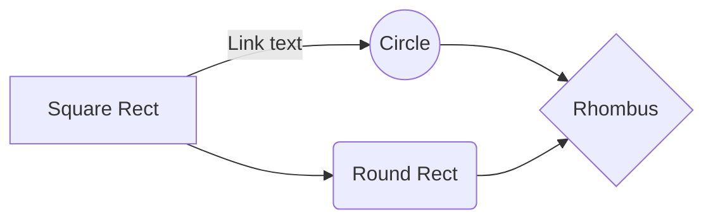

# Make-git-flow

This Python is aimed to make git flow website effortless. The chosen Git Flow is the four stage based on Vincent Driessen "A successful Git branching model"   [post](https://nvie.com/posts/a-successful-git-branching-model/).
The set up will follow [Git flow](https://danielkummer.github.io/git-flow-cheatsheet/index.fr_FR.html). Therefore you might need to install with : 
```
sudo apt-get install git-flow 
```

# How it works

It's a command line tool that ask you for several information intended to automate a website git-flow oriented model.


## The Basic (dev, main)

Two stages is the basic model. Pretty sufficient to test a concept or to make proof of concept. The main is usually on a live website. 
```BASH
git push [branch] dev
git push [branch] main
```

## The Stage (dev, staging, main)

Three stages may be useful to show a pre-production version of the website

## The pro (dev, hotfix, staging, main)

You can rename the current file by clicking the file name in the navigation bar or by clicking the **Rename** button in the file explorer.


# Installing

## Renaming master to main
Because we live in the 21st Century, I'll follow this [blog post](http://www.kapwing.com/blog/how-to-rename-your-master-branch-to-main-in-git/) :

```BASH
git branch -m master main
git push --set-upstream main main
```
Don't forget to change the default branch on Github : 


# Steps
According to [this GitHub](https://gist.github.com/noelboss/3fe13927025b89757f8fb12e9066f2fa)
## On the production server :

```BASH
ssh user@server.com
mkdir ~/deployed_web_site
mkdir ~/project.git
git init --bare ~/project.git
cd ~/project.git
chmod +x hooks/post-receive
```

You 'll have to adapt the content of post-receive according to [~/project.git/hooks/post-receive](https://gist.github.com/noelboss/3fe13927025b89757f8fb12e9066f2fa#file-post-receive) :
```BASH
#!/bin/bash
TARGET="/home/webuser/deployed_web_site"
GIT_DIR="/home/webuser/project.git"
BRANCH="main"

while read oldrev newrev ref
do
	# only checking out the main (or whatever branch you would like to deploy)
	if [ "$ref" = "refs/heads/$BRANCH" ];
	then
		echo "Ref $ref received. Deploying ${BRANCH} branch to production..."
		git --work-tree=$TARGET --git-dir=$GIT_DIR checkout -f $BRANCH
	else
		echo "Ref $ref received. Doing nothing: only the ${BRANCH} branch may be deployed on this server."
	fi
done
```

## Localy :
```BASH
git remote add production user@server.com:project.git
```

## Push to the production server :
```
git push production main
```
## if the deployed_site is not updated :
It might be the rights of the /var/www/html if you choosed this folder. Then it might be usefull to set the rights according to the pupose :
```BASH
sudo useradd -g www-data user
sudo usermod -a -G www-data user
sudo chown -R user:www-data /var/www/html/deployed_site/
```

## git flow init :
$ git flow init
```BASH
Which branch should be used for bringing forth production releases?
   - master
Branch name for production releases: [master] main #because we live in the 21st century
Branch name for "next release" development: [develop] 

How to name your supporting branch prefixes?
Feature branches? [feature/] 
Bugfix branches? [bugfix/]
Release branches? [release/] 
Hotfix branches? [hotfix/]
Support branches? [support/] 
Version tag prefix? [] 
```

## First steps
```BASH
git push origin HEAD:main
```


# Moving a production server
## On the new Server
On the new production server create the two folders : 

```BASH
ssh user@new_server.com
mkdir ~/deployed_new_web_site
mkdir ~/project.git
git init --bare ~/project.git
cd ~/project.git
```
Edit the new server post-receive file with the new information :

```BASH
#!/bin/bash
TARGET="/home/webuser/deployed_new_web_site"
GIT_DIR="/home/webuser/project.git"
BRANCH="main"

while read oldrev newrev ref
do
	# only checking out the main (or whatever branch you would like to deploy)
	if [ "$ref" = "refs/heads/$BRANCH" ];
	then
		echo "Ref $ref received. Deploying ${BRANCH} branch to production..."
		git --work-tree=$TARGET --git-dir=$GIT_DIR checkout -f $BRANCH
	else
		echo "Ref $ref received. Doing nothing: only the ${BRANCH} branch may be deployed on this server."
	fi
done
```
Then make it executable :

```BASH
chmod +x hooks/post-receive
```
## In case the "deployed_new_web_site" is in '/var/www' : 
```BASH
sudo useradd -g www-data user
sudo usermod -a -G www-data user
sudo chgrp -R user:www-data /var/www/deployed_new_web_site
 
```


## On local or dev server :
```
git remote add new_server_production user@new_server.com:project.git
```


## How does it work for multiuser ? 
In my view, It's not good practice to have multiple users updating the website. For the sake of the demonstration, here's how to do it :
a predertimened user should be created. and all the ssh actions should be done thru this user : 

```BASH
sudo -s
adduser new_user
ssh-keygen -b 4096
sudo usermod -a -G sudo user #should it be ?? nah
```
Than on your local station create an ssh connection : 
```BASH
ssh-copy-id -i ~/.ssh/id_<crypting_algorythm>.pub user@server.com
```
yout should have  :
```BASH
Number of key(s) added: 1

Now try logging into the machine, with:   "ssh 'user@<server.com>'"
and check to make sure that only the key(s) you wanted were added.

```
I do an alias : 

alias connect_mots='icz_mots@92.222.71.169'

add it to ~/.bash_aliases


# The models

And this will produce a flow chart:



