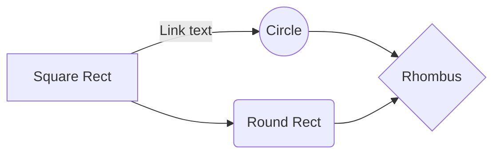

# Make-git-flow

This Python is aimed to make git flow website effortless. The chosen Git Flow is the four stage based on Vincent Driessen "A successful Git branching model"   [post](https://nvie.com/posts/a-successful-git-branching-model/).
The set up will follow [Git flow](https://danielkummer.github.io/git-flow-cheatsheet/index.fr_FR.html). Therefore you might need to install with : 
```
sudo apt-get install git-flow 
```

# How it works

It's a command line tool that ask you for several information intended to automate a website git-flow oriented model.


## The Basic (dev, main)

Two stages is the basic model. Pretty sufficient to test a concept or to make proof of concept. The main is usually on a live website. 
git push [branch] dev
git push [branch] master

## The Stage (dev, staging, main)

Three stages may be useful to show a pre-production version of the website

## The pro (dev, hotfix, staging, main)

You can rename the current file by clicking the file name in the navigation bar or by clicking the **Rename** button in the file explorer.


# Installing
# The models

And this will produce a flow chart:



